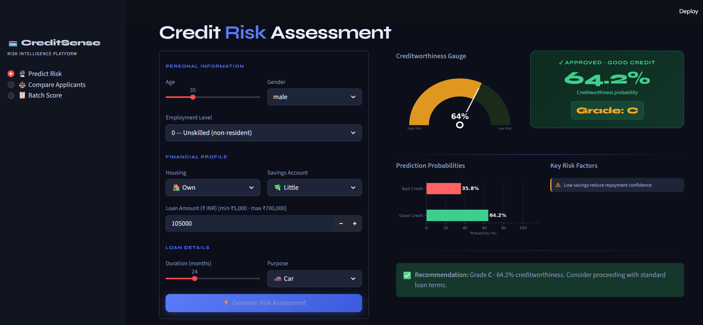

# 💳 CreditSense – Credit Risk Intelligence Platform

An end-to-end **Machine Learning-powered Credit Risk Assessment system** with an interactive **Streamlit dashboard** to evaluate loan applicants, compare profiles, and perform batch scoring.

---

## 🚀 Overview

CreditSense helps financial institutions and analysts make smarter lending decisions by predicting whether a customer is a **good or bad credit risk** based on personal and financial attributes.

It combines:
- 📊 Machine Learning (Scikit-learn)
- 📈 Data Visualization
- 🧠 Risk Interpretation
- ⚡ Real-time Predictions via Streamlit UI

---

## 🖥️ Application Preview

## ✨ Features

### 🔮 Predict Credit Risk
- Input applicant details (age, job, savings, loan, etc.)
- Get:
  - Creditworthiness score (%)
  - Risk classification (Good / Bad)
  - Risk grade (A+ → F)
  - Key risk factors

---

### ⚖️ Compare Applicants
- Compare two applicants side-by-side  
- Identify the better lending candidate instantly  

---

### 📋 Batch Scoring
- Upload CSV file  
- Score multiple applicants at once  
- Download results instantly  

---

## 🧠 Machine Learning Pipeline

- Dataset: German Credit Dataset  
- Preprocessing:
  - Handling missing values  
  - Encoding categorical features  
  - Feature scaling  
- Model:
  - Random Forest Classifier  
- Outputs:
  - Prediction (Good / Bad)  
  - Probability scores  

---

Credit Risk (Good / Bad)
Probability scores
Results are displayed with:
Gauge visualization
Risk factors
Final recommendation
